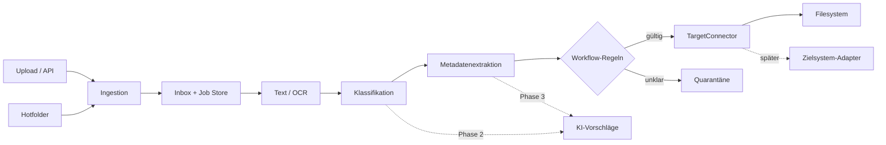

# Architektur

## Leitprinzip

Zuerst wird der deterministische Datenfluss stabilisiert. OCR, Klassifikation, Extraktion, Workflow und Zielsysteme sind austauschbare Bausteine. KI ergänzt später die Verarbeitung, übernimmt aber nicht die Transport- oder Audit-Verantwortung.

## Komponenten

- `api.py`: HTTP-Eingang, Kanalverwaltung und Hotfolder-Lifecycle.
- `pipeline.py`: Orchestrierung und Statusübergänge.
- `processing.py`: Text/OCR, Regeln und später KI-Strategien.
- `connectors.py`: Zielsystemvertrag und Referenzimplementierung.
- `store.py`: SQL-Repository für PostgreSQL und den SQLite-Test-/Entwicklungsfallback.

## Statusmodell

`received → processing → delivered | quarantined | received (Retry) | failed`

Bei manueller Freigabe gilt zusätzlich
`quarantined → delivering → delivered | failed`. Der atomare Wechsel nach `delivering`
ist der Delivery-Claim und verhindert parallele Connector-Aufrufe.

Die API führt keine OCR oder Klassifikation aus. Sie persistiert einen Job mit `received`;
ein separater Worker beansprucht den ältesten fälligen Job mittels `SELECT ... FOR UPDATE
SKIP LOCKED`. Der Claim setzt `worker_id` und `lease_expires_at`. Ein Heartbeat verlängert
die Lease während der Verarbeitung. Nach einem Worker-Abbruch wird der Job nach Ablauf
der Lease von einem anderen Worker übernommen.

Technische Fehler planen den Job mit exponentiellem Backoff erneut ein. Fachlich unklare
Dokumente wechseln ohne Retry nach `quarantined`. Nach Erreichen von `worker_max_attempts`
endet ein technischer Fehler in `failed`.

Jeder Job besitzt ID, Hash, Quelle, Originalname, Status, Metadaten, Fehler und Zeitstempel. Review-Entscheidungen werden mit Bearbeiter, Begründung und Änderungen protokolliert. Für Produktion sind Rollen/Rechte, Verschlüsselung, Aufbewahrung und Löschkonzepte vor Verarbeitung echter Fachdaten verpflichtend.

Zusätzlich wird jeder relevante Verarbeitungsschritt unveränderlich in `job_events`
protokolliert. Zustellereignisse enthalten Zielsystem, Ablageregel, Versuch, Start/Ende,
externe Quittung und Fehler. Die Event-Historie ergänzt den aktuellen Jobzustand und macht
Retries nachvollziehbar; sie ersetzt noch keinen manipulationsgeschützten Compliance-Audit.

Hotfolder-Eingänge sind als `InputChannel` in der SQL-Datenbank gespeichert. Der API-Prozess
liest aktive Kanäle zyklisch, beschränkt ihre Verzeichnisse auf das gemeinsame Datenverzeichnis
und reicht passende Dateien an dieselbe Ingestion-Pipeline wie der HTTP-Upload weiter.

Zielsysteme sind persistente `TargetSystem`-Profile. Beim Ingest wird die ID des aktuellen
Standardziels am Job fixiert. Die Pipeline erzeugt daraus bei der Zustellung den passenden
Dateisystem- oder HTTP-Connector. Dadurch bleiben Transportkonfiguration, Verarbeitung und
fachliche Review-Entscheidung voneinander getrennt.

Nach der regelbasierten Klassifikation sucht die Pipeline die erste aktive `DeliveryRule`
für den Dokumenttyp. Eine Regel kann Zielsystem und Pfadvorlage überschreiben. Die konkrete
Pfadauflösung erfolgt erst im Dateisystem-Connector und bleibt auf dessen konfigurierten
Ablageordner begrenzt.

Die deterministische Rechnungsverarbeitung extrahiert zunächst Lieferanten mit gängigen
Rechtsformen sowie numerische oder deutsch ausgeschriebene Dokumentdaten. Pfadplatzhalter
verwenden diese Metadaten, ohne die Originalwerte zu verändern; nur der resultierende
Ordnername wird sicher normalisiert.

Quarantänisierte Jobs können manuell klassifiziert, mit einer generischen `routing_reference`
versehen und anschließend erneut validiert werden. Die Freigabe ist idempotent und vom Review
getrennt; Connector-spezifische Policies bestimmen, ob eine Routing-Referenz Pflicht ist.

## Nächste technische Grenzen

- Als nächster Robustheitsschritt sollten Worker-Metriken, kontrolliertes Shutdown und
  eine belastbare Fehleranzeige für Eingangskanäle ergänzt werden.
- PDF-Text-Layer und mehrseitiger OCR-Fallback sind implementiert; als nächster Schritt
  sollte die Extraktion hinter ein explizites Adapter-Interface gezogen werden.
- KI liefert Vorschlag, Konfidenz, Modellversion und Evidenz; Workflow-Schwellen entscheiden über Auto-Übernahme oder Review.
