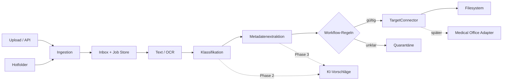

# Architektur

## Leitprinzip

Zuerst wird der deterministische Datenfluss stabilisiert. OCR, Klassifikation, Extraktion, Workflow und Zielsysteme sind austauschbare Bausteine. KI ergänzt später die Verarbeitung, übernimmt aber nicht die Transport- oder Audit-Verantwortung.

## Komponenten

- `api.py`: HTTP-Eingang und Hotfolder-Lifecycle.
- `pipeline.py`: Orchestrierung und Statusübergänge.
- `processing.py`: Text/OCR, Regeln und später KI-Strategien.
- `connectors.py`: Zielsystemvertrag und Referenzimplementierung.
- `store.py`: einfacher JSON-Jobstore für das MVP.

## Statusmodell

`received → processing → delivered | quarantined | failed`

Jeder Job besitzt ID, Hash, Quelle, Originalname, Status, Metadaten, Fehler und Zeitstempel. Für Produktion sind unveränderliche Audit-Events, Rollen/Rechte, Verschlüsselung, Aufbewahrung und DSGVO-Löschkonzepte vor Verarbeitung echter Patientendaten verpflichtend.

## Nächste technische Grenzen

- Der JSON-Store wird durch PostgreSQL und eine Event-/Queue-Lösung ersetzt.
- Der synchrone Prozessor wird ein Worker; die API antwortet dann mit `202 Accepted`.
- PDF-Text-Layer und mehrseitiger OCR-Fallback sind implementiert; als nächster Schritt
  sollte die Extraktion hinter ein explizites Adapter-Interface gezogen werden.
- KI liefert Vorschlag, Konfidenz, Modellversion und Evidenz; Workflow-Schwellen entscheiden über Auto-Übernahme oder Review.
