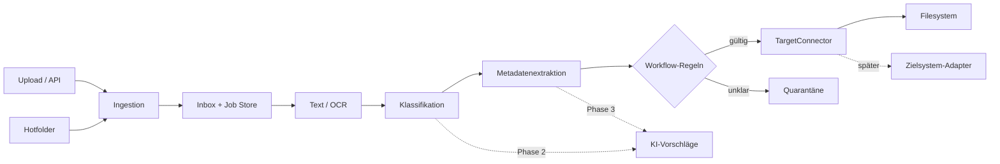

# Architektur

## Leitprinzip

Zuerst wird der deterministische Datenfluss stabilisiert. OCR, Klassifikation, Extraktion, Workflow und Zielsysteme sind austauschbare Bausteine. KI ergänzt später die Verarbeitung, übernimmt aber nicht die Transport- oder Audit-Verantwortung.

## Komponenten

- `api.py`: HTTP-Eingang und Hotfolder-Lifecycle.
- `pipeline.py`: Orchestrierung und Statusübergänge.
- `processing.py`: Text/OCR, Regeln und später KI-Strategien.
- `connectors.py`: Zielsystemvertrag und Referenzimplementierung.
- `store.py`: SQL-Repository für PostgreSQL und den SQLite-Test-/Entwicklungsfallback.

## Statusmodell

`received → processing → delivered | quarantined | failed`

Bei manueller Freigabe gilt zusätzlich
`quarantined → delivering → delivered | failed`. Der atomare Wechsel nach `delivering`
ist der Delivery-Claim und verhindert parallele Connector-Aufrufe.

Jeder Job besitzt ID, Hash, Quelle, Originalname, Status, Metadaten, Fehler und Zeitstempel. Review-Entscheidungen werden mit Bearbeiter, Begründung und Änderungen protokolliert. Für Produktion sind Rollen/Rechte, Verschlüsselung, Aufbewahrung und Löschkonzepte vor Verarbeitung echter Fachdaten verpflichtend.

Quarantänisierte Jobs können manuell klassifiziert, mit einer generischen `routing_reference`
versehen und anschließend erneut validiert werden. Die Freigabe ist idempotent und vom Review
getrennt; Connector-spezifische Policies bestimmen, ob eine Routing-Referenz Pflicht ist.

## Nächste technische Grenzen

- Die synchrone Verarbeitung wird als nächster Schritt durch einen Worker und eine
  persistente Queue ersetzt.
- Der synchrone Prozessor wird ein Worker; die API antwortet dann mit `202 Accepted`.
- PDF-Text-Layer und mehrseitiger OCR-Fallback sind implementiert; als nächster Schritt
  sollte die Extraktion hinter ein explizites Adapter-Interface gezogen werden.
- KI liefert Vorschlag, Konfidenz, Modellversion und Evidenz; Workflow-Schwellen entscheiden über Auto-Übernahme oder Review.
